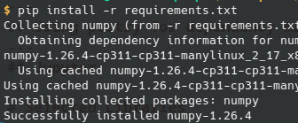
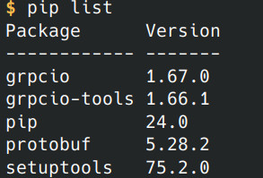

<!-- _class: lead -->

# Dependecy Management with Python

## What is dependency management
* Collecting all libraries automatically
* Keep control on lib versions
* Enable automatic builds -> sine qua non releasing!
* Also for individual projects
* Makes your code usable for others
* Version control, documentation & dependency management - never without any of those!
* Python packages are listed here: https://pypi.org/
---

## Using pip for dependency management
* pip standard dependency management tool
* downloads and unpacks libraries
* Example requests: https://pypi.org/project/requests/
* Libs can be installed globally, per user or in virtual environments
* Recursive - dependencies of dependencies
* But: multiple versions of same library are not possible -> virt envs
* For this course we will use pip

---
### Pip requirements example
* Pip can download all packages listed in __requirements.txt__
* Fix version number/range for libs
  * numpy==1.26.4 vs requests>=2.31.0 
* Multiple calls result in same target state
* Run example
```bash
  cd 01-depmanagement-pip
  python3 -m venv .venv
  source .venv/bin/activate
  pip install -r requirements.txt 
```


__Make sure you understand this idea - we will use from now on!__

---
## Install Libraries & virtual environments
* pip can be used to install libraries, however no more than one version per lib
* Solution: Virtual Environments
```bash
  python3 -m venv .venv
  source .venv/bin/activate
```

```bash
  pip install numpy
```


Note: Do not forget to put all installed libs into requirements.txt!

---
### Virtual envs in detail
* venv folder should considered as temporary - nothing peristent belongs there!
* it mostly mirrors central folder structures


---
### Tips and tricks for virtual envs
* When developing in Python you will work with many virtual envs - make sure, know which one is currently active
* This is how virtual envs are deactivated
  ```bash
  deactivate
  ```
* Conventions can help - don't install libraries manually, always via requirements.txt
* Package apps in Docker files - there is no use, try to maintain an environment any other way
* Versioning dependency can be a mess in larger projects - test for incompatible indirect lib versions e.g. numpy
* List all installed libs in a virtual env with
  ```bash
  pip list
  ```
  
---

## Using poetry for dependency management
* same library repository as pip
* support to build _and_ publish
* [TOML](https://en.wikipedia.org/wiki/TOML) file for config
* Much more powerfull than pip
---
### Poetry example
* Install Poetry
  ```bash
  apt install python3-poetry
  ```
* Run example
  ```bash
    cd 02-depmanagement-poetry
    poetry install
    poetry run my-script
  ```

<style>
header {
  text-align: right;
  font-size: 0.7rem;
  color: #bbb;
  margin: 20px;
  left: 0px;
  right: 0px;
  padding-top: 5px;
}
footer {
  font-size: 0.7rem;
  color: #bbb;
}
section.lead {
  text-align: center;
  margin-bottom: 40px;
}
section {
  font-size: 1.2rem;
}
section.lead h1 {
  font-size: 2.5rem;
  font-weight: 600;
}
section.linked footer {
  display: none;
}
section.linked header {
  display: none;
}
section.quote {
  font-size: 1.0rem;
  text-align: center;
  font-style: italic;
  color: #555;
}

h1 {
  font-size: 2.5rem;
  font-weight: 500;
  color: #2B5A6A;
}
h2 {
  font-size: 1.8rem;
  font-weight: 400;
  color: #333;
  margin-top: 30px;
  margin-bottom: 15px;
  text-transform: uppercase;
}
a {
  color: #3A9FC1;
}
a:hover {
  color: #1E708B; 
  text-decoration: underline; 
}
ul {
  text-align: left
}

</style>