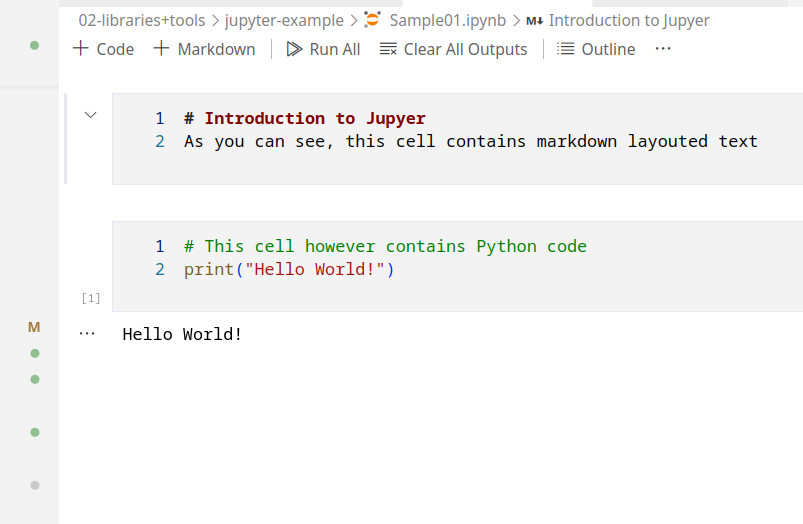
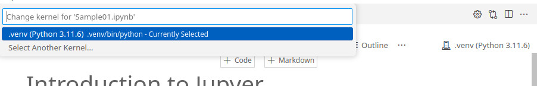

<!-- _class: lead -->
# Chapter 2 - Tools & Libraries
---
## Overview
In this chapter various helpful tools and libraries are introduced, that are essential, to make developing with Python easier.
* Pip with requirements
* Poetry https://python-poetry.org/
* Jupyter
* numpy
* matplotlib/plotly/seaborn
* SciPy
* statistics module
* Pandas
---
## What is dependency management
* Collecting all libraries automatically
* Keep control on lib versions
* Enable automatic builds -> sine qua non releasing!
* Also for individual projects
* Makes your code usable for others
* Version control, documentation & dependency management - never without any of those!
* Python packages are listed here: https://pypi.org/
---

## Using pip for dependency management
* pip standard dependency management tool
* downloads and unpacks libraries
* Example requests: https://pypi.org/project/requests/
* Libs can be installed globally, per user or in virtual environments
* Recursive - dependencies of dependencies
* But: multiple versions of same library are not possible -> virt envs
* For this course we will use pip

---
### Pip requirements example
* Pip can download all packages listed in __requirements.txt__
* Fix version number/range for libs
  * numpy==1.26.4 vs requests>=2.31.0 
* Multiple calls result in same target state
* Run example
```bash
  cd 01-depmanagement-pip
  python3 -m venv .venv
  source .venv/bin/activate
  pip install -r requirements.txt 
```


__Make sure you understand this idea - we will use from now on!__

---
## Using poetry for dependency management
* same library repository as pip
* support to build _and_ publish
* [TOML](https://en.wikipedia.org/wiki/TOML) file for config
* Much more powerfull than pip
---
### Poetry example
* Install Poetry
  ```bash
  apt install python3-poetry
  ```
* Run example
  ```bash
    cd 02-depmanagement-poetry
    TODO
  ```
---
# Docker Compose & TimescaleDB
* [TimescaleDB](https://www.timescale.com/) extension of PostgreSQL database for time series data
* Nice set of [functions](https://docs.timescale.com/api/latest/)
* If you don't like command line operations use [pgAdmin](https://www.pgadmin.org/download/)
* For CLI users 
  ```Bash
    psql -h localhost -p 5432 -U postgres
  ```
* Timescale supports large time series tables (hypertables)
* [Example](04-timeseries/01-connect-timescaledb.py) how to connect from Python
---
## Timescale Tasks
### Task 01 - Create structures
__Create Table & HyperTable__
```SQL
  CREATE TABLE public.responsetimes
  (
    "url" TEXT NOT NULL,
    "measuretime" timestamp with time zone NOT NULL,
    "responsetime" BIGINT NOT NULL
  );
  SELECT create_hypertable('responsetimes', 'measuretime');
```  
__Sample Input__
```SQL
  INSERT INTO public.responsetimes ("url", "measuretime", "responsetime")
  VALUES ('http://worldtimeapi.org/api/timezone/Europe/Berlin', '2024-06-06 12:34:56+00', 54782);
```
---
### Task 01
  * measure response time of web address and write to CSV file [Task](03-timeseries/02-measure-response-time.py)
### Task 02
  * Write same data into a time series data base [hint](https://docs.timescale.com/quick-start/latest/python/)
---
## Jupyter
* Typical data exploration workflow:
  * load data
  * show sample data
  * write analysis code
  * show results
  * extend code
* Jupyter is a tool, that supports this workflow
* We use classic notebooks (intensively) for this course
* VSCode extension: Jupyter
* Note: Notebooks can and should be under version control
---
### Setting up Jupyter
Jupyter can be run as a browsable service like so:
```bash
  cd 04-jupyter-example
  python3 -m venv .venv
  source .venv/bin/activate
  pip install -r requirements.txt 
  jupyter notebook
```
Last command will open a browser tab and you can start working with notebooks.

VSCode can run notebooks and that is the preferred usage for this course. Use the power of an IDE :)

---
### Running example

Running a notebook in VScode



---
### Virtual envs, VSCode & Jupyter
VSCode supports running Jupyter notebooks code in virtual environments:

* Keep in mind to manage your notebooks and virtual envs

---
# Selected Libraries

The following section introduces selected Python libraries, that are useful for data analytics and AI projects. It is by no means complete and will be extended.

You will find for every library example file(s), that will provide a quick intro. However for tasks if not already existing, create a Jupyter notebook.

---
## Numpy
* NumPy: numeric Python - actually C -> fast
* Mostly for matrix operations
* Large set of mathematical functions
* used by everything
* https://numpy.org/doc/1.26/user/absolute_beginners.html
* https://www.w3schools.com/python/numpy/ 
* Test you knowledge: https://www.w3schools.com/python/numpy/exercise.asp
* [Examples and tasks](05-numpy/)

---
## Plotting data
* numbers are boring
* many libs in Python for the job available
* GUI framework is necessary - unless you use Jupyter
* Tcl/Tk as (ugly) standard
  ```bash
  apt install python3-tk
  ```
* [Examples and tasks](06-plotting/)

---
## SciPy
* SciPy: Scientific Python
* Builds on top of numpy, large set of more mathematical functions
* https://scipy.org/
* To a certain degree an alternative to MATLAB
* [Examples and tasks](07-scipy/)

---
## statistics module
* Part of Python standard libs
* Basic statistical functions
* If it works - don't use more complicated stuff
* [Examples and tasks](08-statistics/)

---
## Pandas
* library for time series and numerical tables
* easy import/export to various data sources (CSV,SQL)
* "Excel for Python"
* [Examples and tasks](09-pandas/)

<style>
header {
  text-align: right;
  font-size: 0.7rem;
  color: #bbb;
  margin: 20px;
  left: 0px;
  right: 0px;
  padding-top: 5px;
}
footer {
  font-size: 0.7rem;
  color: #bbb;
}
section.lead {
  text-align: center;
  margin-bottom: 40px;
}
section {
  font-size: 1.2rem;
}
section.lead h1 {
  font-size: 2.5rem;
  font-weight: 600;
}
section.linked footer {
  display: none;
}
section.linked header {
  display: none;
}
section.quote {
  font-size: 1.0rem;
  text-align: center;
  font-style: italic;
  color: #555;
}

h1 {
  font-size: 2.5rem;
  font-weight: 500;
  color: #2B5A6A;
}
h2 {
  font-size: 1.8rem;
  font-weight: 400;
  color: #333;
  margin-top: 30px;
  margin-bottom: 15px;
  text-transform: uppercase;
}
a {
  color: #3A9FC1;
}
a:hover {
  color: #1E708B; 
  text-decoration: underline; 
}
ul {
  text-align: left
}

</style>